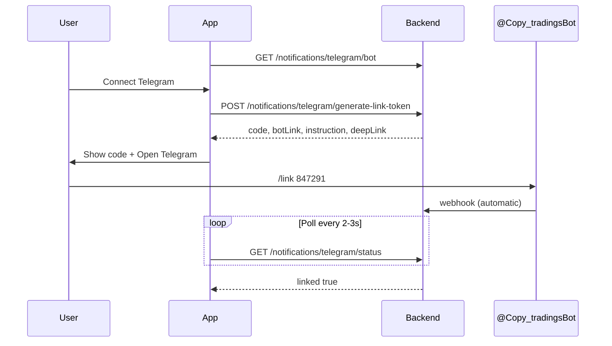

# Frontend — Current Integration Guide (May 2026)

**This is the primary document for the FE team.** It reflects what is deployed on production today.

| | |
|---|---|
| **Production API** | `https://api.ascentracapital.com` |
| **Fallback / direct EC2** | `http://13.53.246.13:8081` |
| **Prefix** | `/api/v1` |
| **Auth header** | `Authorization: Bearer <accessToken>` |
| **Access token TTL** | ~15 minutes — use refresh token |
| **Swagger** | `GET /swagger-ui.html` |
| **Roles** | `MASTER` \| `CHILD` \| `ADMIN` (uppercase) |

---

## Document map (what to read when)

| Document | Use for |
|----------|---------|
| **This file** | Day-to-day integration, new screens, request/response shapes |
| [FE-INTEGRATION-GUIDE.md](./FE-INTEGRATION-GUIDE.md) | Same content, more detail on engine/risk/Telegram sections |
| [SYSTEM-ARCHITECTURE.md](./SYSTEM-ARCHITECTURE.md) | How the system is built — architecture, tech stack, latency |
| [PLATFORM-GUIDE.md](./PLATFORM-GUIDE.md) | Full backend behaviour, brokers, engine, ops |
| [TELEGRAM-LINK-UNLINK.md](./TELEGRAM-LINK-UNLINK.md) | Short link / unlink steps for users |
| [TELEGRAM-SETUP.md](./TELEGRAM-SETUP.md) | Ops / webhook / EC2 only (not FE) |
| [GAP-DOCS-CORRECTIONS.md](./GAP-DOCS-CORRECTIONS.md) | Old gap-analysis mistakes — do not trust external MDs without checking here |

---

## 1. HTTP client setup

```typescript
const API_BASE = import.meta.env.VITE_API_URL ?? 'https://api.ascentracapital.com';

async function api<T>(path: string, options: RequestInit = {}): Promise<T> {
  const token = localStorage.getItem('accessToken');
  const res = await fetch(`${API_BASE}/api/v1${path}`, {
    ...options,
    headers: {
      'Content-Type': 'application/json',
      ...(token ? { Authorization: `Bearer ${token}` } : {}),
      ...options.headers,
    },
  });
  if (!res.ok) throw await res.json().catch(() => ({ message: res.statusText }));
  return res.json();
}
```

**Rules**

- Send roles as **`MASTER`**, **`CHILD`**, **`ADMIN`** (not Title Case).
- Treat **`success`** and **`linked`** as **booleans**, not strings (`true` not `"true"`).
- Logout body: `{ "refreshToken": "..." }` → response `{ "success": true, "message": "..." }`.

---

## 2. Authentication

### 2.1 Login

```http
POST /api/v1/auth/login
Content-Type: application/json

{ "email": "user@example.com", "password": "..." }
```

**Response (use these fields):**

```json
{
  "accessToken": "eyJ...",
  "refreshToken": "eyJ...",
  "requires2FA": false,
  "user": {
    "userId": "uuid",
    "name": "string",
    "email": "string",
    "role": "MASTER",
    "status": "ACTIVE",
    "phone": "+91...",
    "telegramChatId": null,
    "twoFactorEnabled": false,
    "createdAt": "ISO8601",
    "brokerAccounts": []
  }
}
```

Normalize in FE:

```typescript
user.id = user.userId ?? user.id;
```

`brokerAccounts` on login may be empty; load brokers via `/brokers/accounts` after login.

### 2.2 Refresh

```http
POST /api/v1/auth/refresh-token
{ "refreshToken": "..." }
```

Returns new `accessToken` and `refreshToken`.

### 2.3 Logout

```http
POST /api/v1/auth/logout
{ "refreshToken": "..." }
```

```json
{ "success": true, "message": "Logged out successfully" }
```

Use `if (data.success === true)` — not string compare.

### 2.4 Current user

```http
GET /api/v1/auth/me
```

Same user fields as login. Prefer for header/profile when already authenticated.

**Profile update (legacy):**

```http
PUT /api/v1/auth/me
{ "name": "...", "phone": "...", "currentPassword": "...", "newPassword": "..." }
```

### 2.5 Phone OTP

| Method | Path | Body |
|--------|------|------|
| POST | `/auth/send-otp` | `{ "phone": "+91..." }` |
| POST | `/auth/verify-otp` | `{ "phone": "+91...", "otp": "123456" }` |

OTP errors use field **`error`** (e.g. `OTP_EXPIRED`), not only `errorCode`:

```typescript
const code = err?.error ?? err?.errorCode;
```

### 2.6 2FA enable

```http
POST /api/v1/auth/2fa/enable
```

**Backend returns:**

```json
{ "secret": "BASE32...", "qrCodeUri": "otpauth://totp/..." }
```

**FE:** read QR as `data.qrCodeUri ?? data.qrCode` (Profile should support both).

---

## 3. User profile (broker margin UI)

### 3.1 Spec path (preferred for Profile → Broker accounts tab)

```http
GET /api/v1/users/me/profile
```

```json
{
  "userId": "uuid",
  "name": "string",
  "email": "string",
  "mobile": "+91...",
  "role": "MASTER",
  "createdAt": "ISO8601",
  "telegramLinked": true,
  "brokerAccounts": [
    {
      "accountId": "uuid",
      "broker": "ZERODHA",
      "clientId": "ZR1234",
      "marginAvailable": 125000,
      "marginUsed": 25000,
      "marginUsedPercent": 16.7,
      "fundsUtilizationStatus": "GREEN",
      "openPositionsCount": 3,
      "sessionActive": true,
      "tokenExpiresAt": "ISO8601",
      "isTokenExpired": false
    }
  ]
}
```

`fundsUtilizationStatus`: **`GREEN`** \| **`YELLOW`** \| **`RED`**

```http
PUT /api/v1/users/me/profile
{ "name": "...", "displayName": "..." }
```

Both `name` and `displayName` are accepted for display name.

Optional manual Telegram (discouraged vs bot flow): `{ "telegramChatId": "123456789" }`

### 3.2 Single broker profile

```http
GET /api/v1/brokers/accounts/{accountId}/profile
POST /api/v1/brokers/accounts/{accountId}/refresh-profile
```

---

## 4. Brokers — connect & OAuth

### 4.1 List brokers

```http
GET /api/v1/brokers
```

Each broker includes **`loginMethod`** and **`loginField`** when OAuth:

| Broker | loginField for POST .../login |
|--------|-------------------------------|
| ZERODHA | `requestToken` |
| FYERS / UPSTOX | `authCode` |
| DHAN | `tokenId` |
| ANGELONE | `totpCode` |

Do **not** hardcode `IP_WHITELIST_BROKERS` in FE if possible — future: API will expose `requiresIpWhitelist`.

### 4.2 OAuth URL (required for DematConnected)

```http
GET /api/v1/brokers/accounts/{accountId}/oauth-url
```

```json
{
  "oauthUrl": "https://kite.zerodha.com/...",
  "loginField": "requestToken"
}
```

After redirect, POST login with **dynamic key**:

```typescript
await api(`/brokers/accounts/${accountId}/login`, {
  method: 'POST',
  body: JSON.stringify({ [loginField]: callbackToken }),
});
```

### 4.3 Accounts list

```http
GET /api/v1/brokers/accounts
GET /api/v1/brokers/accounts/{id}/status
GET /api/v1/brokers/accounts/{id}/test
GET /api/v1/brokers/accounts/{id}/dashboard
```

---

## 5. Child — subscriptions & copy settings

### 5.1 Subscribe

```http
POST /api/v1/child/subscriptions
```

```json
{
  "masterId": "uuid",
  "brokerAccountId": "uuid",
  "scalingFactor": 0.5,
  "copySides": "BUY_ONLY",
  "allowShortSelling": false,
  "allocationAmount": 50000
}
```

**Note:** `allocationAmount` is accepted on subscribe but may still return `0` on GET until fully persisted — show UI but expect backend catch-up.

`copySides`: **`BUY_ONLY`** \| **`BUY_AND_SELL`** \| **`MIRROR`**

### 5.2 List subscriptions

```http
GET /api/v1/child/subscriptions
```

Includes: `masterName`, `copySides`, `allowShortSelling`, `copyingStatus`, `scalingFactor`, `brokerAccountId`, `allocationAmount` (may be 0).

### 5.3 Update copy settings

```http
PATCH /api/v1/child/subscriptions/copy-settings
```

```json
{
  "masterId": "uuid",
  "copySides": "BUY_AND_SELL",
  "allowShortSelling": false
}
```

### 5.4 Trade timeline

```http
GET /api/v1/child/trade-timeline
```

Per item (use these names):

| Field | Description |
|-------|-------------|
| `eventId` | Group id |
| `masterName` | |
| `symbol` | |
| `side` | BUY / SELL |
| `masterTriggeredAt` | ISO8601 |
| `myOrderPlacedAt` | ISO8601 |
| `totalChildLatencyMs` | number |
| `status` | SUCCESS / FAILED / … |
| `skipReason` | string or null |

---

## 6. Risk (child)

```http
GET /api/v1/risk/rules
PUT /api/v1/risk/rules
GET /api/v1/risk/status?brokerAccountId={uuid}
GET /api/v1/risk/exposure?brokerAccountId={uuid}
POST /api/v1/risk/pause
POST /api/v1/risk/resume
POST /api/v1/risk/check-trade
```

**`GET /risk/status`** includes:

```json
{
  "tradesToday": 14,
  "maxTradesPerDay": 50,
  "openPositions": 3,
  "maxOpenPositions": 20,
  "marginUtilizationPct": 42.5,
  "marginBlocked": false,
  "availableMargin": 125000,
  "copyPaused": false,
  "pausedUntil": null,
  "allowed": true
}
```

Show red banner when **`marginBlocked === true`**.

---

## 7. Engine — history & latency

Master order polling runs every **500 ms** by default (`GET /engine/config` → `pollingIntervalMs`). Zerodha can use postback for ~100 ms detection.

```http
GET /api/v1/engine/trade-history?page=0&size=20
GET /api/v1/engine/trade-history/{eventId}
GET /api/v1/engine/latency-stats?days=7
GET /api/v1/engine/metadata
GET /api/v1/engine/config
```

**Pagination:** engine uses **0-based** `page` + `size`. Some admin lists use 1-based — check each screen.

**`GET /engine/metadata`** — load once for dropdowns:

- `copySidesOptions`
- `skipReasons` (labels for copy logs)
- `notificationTypes`

---

## 8. Telegram notifications (per user)

### Important

- **One bot for the platform:** [@Copy_tradingsBot](https://t.me/Copy_tradingsBot)
- **Each user** links **their own** Telegram; alerts go to whoever sent `/link CODE` for that login.
- **Do not hardcode** bot name in React — read from API.

### 8.1 Public bot config (no JWT)

```http
GET /api/v1/notifications/telegram/bot
```

```json
{
  "enabled": true,
  "botUsername": "Copy_tradingsBot",
  "botLink": "https://t.me/Copy_tradingsBot",
  "instruction": "Generate a code while logged in, then send /link CODE to @Copy_tradingsBot"
}
```

Call on Telegram settings page mount.

### 8.2 Connect flow (UI)



| Step | API | Auth |
|------|-----|------|
| Load bot info | `GET /notifications/telegram/bot` | No |
| Generate code | `POST /notifications/telegram/generate-link-token` | Yes |
| Poll status | `GET /notifications/telegram/status` | Yes |
| Test | `POST /notifications/telegram/test` | Yes |
| Preferences | `PUT /notifications/telegram/preferences` | Yes |
| Unlink | `POST /notifications/telegram/unlink` | Yes |

**Generate code response:**

```json
{
  "code": "847291",
  "expiresAt": "2026-05-26T07:31:05Z",
  "botUsername": "Copy_tradingsBot",
  "botLink": "https://t.me/Copy_tradingsBot",
  "deepLink": "https://t.me/Copy_tradingsBot?start=link_847291",
  "instruction": "Open @Copy_tradingsBot in Telegram and send: /link 847291"
}
```

Code expires in **10 minutes**.

**Status response:**

```json
{
  "linked": true,
  "chatId": "123456789",
  "botUsername": "Copy_tradingsBot",
  "botLink": "https://t.me/Copy_tradingsBot",
  "preferences": {
    "tradeAlerts": true,
    "riskAlerts": true,
    "dailySummary": true,
    "systemAlerts": false,
    "alertOnSuccess": true,
    "alertOnFailure": true,
    "alertOnSkipped": true
  }
}
```

**UI copy example**

> 1. Tap **Open Telegram**  
> 2. Send: `/link 847291`  
> 3. Return here and tap **Refresh**

### 8.3 Sample React snippet

```typescript
export async function loadTelegramBot() {
  return api<{
    enabled: boolean;
    botUsername: string;
    botLink: string;
    instruction: string;
  }>('/notifications/telegram/bot', { method: 'GET' });
}

export async function connectTelegramFlow(onLinked: () => void) {
  const link = await api<TelegramLinkTokenResponse>(
    '/notifications/telegram/generate-link-token',
    { method: 'POST' }
  );
  window.open(link.botLink, '_blank');
  const interval = setInterval(async () => {
    const st = await api<{ linked: boolean }>('/notifications/telegram/status');
    if (st.linked) {
      clearInterval(interval);
      onLinked();
    }
  }, 2500);
  return link;
}
```

---

## 9. Copy logs & skip reasons

Use labels from **`GET /engine/metadata`** → `skipReasons`.

Common codes (show user-friendly text):

| Code | Suggested label |
|------|-----------------|
| `ZERO_QUANTITY` | Quantity rounded to zero |
| `SUB_LOT_SIZE` | Below minimum lot (F&O) |
| `RISK_LIMIT` | Risk rule blocked |
| `MAX_CAPITAL_EXPOSURE` | Margin exposure limit |
| `NO_POSITION` / `INSUFFICIENT_POSITION` | No position to sell |
| `SELL_BLOCKED` | Sell not allowed by settings |
| `MARKET_CLOSED` | Market closed (intraday) |
| `COPY_PAUSED` | Copying paused |
| `SESSION_EXPIRED` | Broker session expired |

**Notifications:** map `SESSION_EXPIRED` → show re-login CTA (broker account).

---

## 10. Master copy trading & P&L (fixes follower table ₹0)

### 10.1 Copy trading page (preferred — one call)

```http
GET /api/v1/master/copy-trading
Authorization: Bearer <token>
```

Returns: `activeAccount` (master margin), `children[]` (live margin + P&L), `dashboard`, `alerts`, `pollingIntervalMs`.

**Each child row includes:**

| Field | UI column |
|-------|-----------|
| `margin` / `marginAvailable` | MARGIN |
| `pnlToday` / `pnl` | P&L TODAY (unrealized from open positions) |
| `pos` / `openPositionsCount` | POS |
| `scalingFactor` / `multiplier` | MULTIPLIER |
| `sessionActive`, `lowMargin` | Warnings |

**Note:** Margin is **₹0** when child broker session expired or not linked — show reconnect CTA, not a backend bug.

### 10.2 P&L analytics page

```http
GET /api/v1/master/pnl-analytics
```

Returns `summary` (combined unrealized P&L, copy success rate), `childPerformance`, `dailyChart` (7 days).

### 10.3 Other master endpoints

```http
GET /api/v1/master/children          # enriched list (margin + pnl)
GET /api/v1/master/dashboard         # must include /master/ prefix + JWT
GET /api/v1/master/active-account    # master margin + connected flag
GET /api/v1/master/trade-pnl
GET /api/v1/master/analytics
```

**FE bug to fix:** Calls to `/dashboard` or `/trades` without `/api/v1/master/` and without `Authorization` header return **401 empty body**.

---

## 11. Screen → API quick map

| Screen | APIs |
|--------|------|
| Login | `POST /auth/login`, `POST /auth/verify-otp` |
| Register | `POST /auth/register` |
| Profile | `GET /users/me/profile`, `PUT /users/me/profile` |
| Telegram settings | `GET /notifications/telegram/bot`, generate/status/test/unlink |
| Demat list | `GET /brokers/accounts` |
| Demat OAuth | `GET .../oauth-url`, `POST .../login` with `loginField` |
| Child subscribe | `POST /child/subscriptions`, `PATCH .../copy-settings` |
| My masters | `GET /child/subscriptions` |
| Risk settings | `GET/PUT /risk/rules`, `GET /risk/status`, pause/resume |
| Copy logs (child) | `GET /child/copy/logs` |
| Copy logs (master) | `GET /master/copy/logs` |
| **Master copy trading** | **`GET /master/copy-trading`** |
| **Master P&L analytics** | **`GET /master/pnl-analytics`** |
| Latency | `GET /engine/latency-stats`, `GET /child/trade-timeline` |
| Master P&L | `GET /master/trade-pnl` |

---

## 12. What is still stubbed / partial (set expectations)

| Feature | FE expectation |
|---------|----------------|
| `GET /child/masters` marketplace | Fields exist but many metrics are placeholder zeros |
| `GET /child/analytics` | Basic counts only; charts need future backend |
| `GET /master/analytics` | Partial; `earningsBreakdown` may be stubbed |
| `allocationAmount` on subscriptions | May show `0` until DB persistence complete |
| WebSocket event schemas | **Not documented** — do not rely on undocumented events |
| Admin analytics charts | Partial data |

---

## 13. TypeScript types (copy-paste)

```typescript
export type Role = 'MASTER' | 'CHILD' | 'ADMIN';
export type CopySides = 'BUY_ONLY' | 'BUY_AND_SELL' | 'MIRROR';

export interface AuthUser {
  userId: string;
  id?: string;
  name: string;
  email: string;
  role: Role;
  status: string;
  phone?: string;
  telegramChatId?: string | null;
  twoFactorEnabled: boolean;
  brokerAccounts?: unknown[];
}

export interface LoginResponse {
  accessToken: string;
  refreshToken: string;
  requires2FA?: boolean;
  user: AuthUser;
}

export interface LogoutResponse {
  success: boolean;
  message: string;
}

export interface TelegramBotConfig {
  enabled: boolean;
  botUsername: string;
  botLink: string;
  instruction: string;
}

export interface TelegramLinkTokenResponse {
  code: string;
  expiresAt: string;
  botUsername: string;
  botLink: string;
  deepLink: string;
  instruction: string;
}

export interface TelegramStatusResponse {
  linked: boolean;
  chatId?: string | null;
  botUsername: string;
  botLink: string;
  preferences: Record<string, boolean>;
}

export interface OAuthUrlResponse {
  oauthUrl: string;
  loginField: string;
}

export interface RiskStatus {
  tradesToday: number;
  maxTradesPerDay: number;
  openPositions: number;
  maxOpenPositions: number;
  marginUtilizationPct: number;
  marginBlocked: boolean;
  availableMargin: number;
  copyPaused: boolean;
  pausedUntil: string | null;
  allowed: boolean;
}
```

---

## 14. FE release checklist

### Required for existing app (no breaking changes)

- [ ] Logout checks `success === true` (boolean)
- [ ] OAuth callback uses `loginField` from `oauth-url` response
- [ ] 2FA QR: `qrCodeUri ?? qrCode`

### New features (ship when UI ready)

- [ ] Telegram: use `GET /notifications/telegram/bot` — **never hardcode** `Copy_tradingsBot`
- [ ] Telegram connect: generate → show `/link CODE` → poll status
- [ ] Copy sides + allow short selling on subscribe/settings
- [ ] Risk card: `marginBlocked`, pause/resume
- [ ] Profile broker tab: `/users/me/profile` margin fields
- [ ] Skip reason labels from `/engine/metadata`
- [ ] Trade timeline / engine history pages

### Do not use from old gap docs without verification

- Wrong bot names (`AscentraCapitalBot`, `AscentraAlertBot`)
- Claim that `PATCH copy-settings` or `trade-timeline` are missing — **they exist**
- String `"success": "true"` on logout — **fixed**

---

## 15. Test accounts (staging)

| Email | Password | Role |
|-------|----------|------|
| `mastertwo@gmail.com` | `master2@123` | MASTER |

Use production base URL only if that account exists there.

---

## 16. Support / questions

- Backend behaviour: [PLATFORM-GUIDE.md](./PLATFORM-GUIDE.md)  
- Telegram EC2/webhook: [TELEGRAM-SETUP.md](./TELEGRAM-SETUP.md)  
- Spec vs built: [ASCENTRA-SPEC-GAP.md](./ASCENTRA-SPEC-GAP.md)

**Primary FE doc:** keep this file (`FE-CURRENT-INTEGRATION.md`) as the entry point for every integration task.
