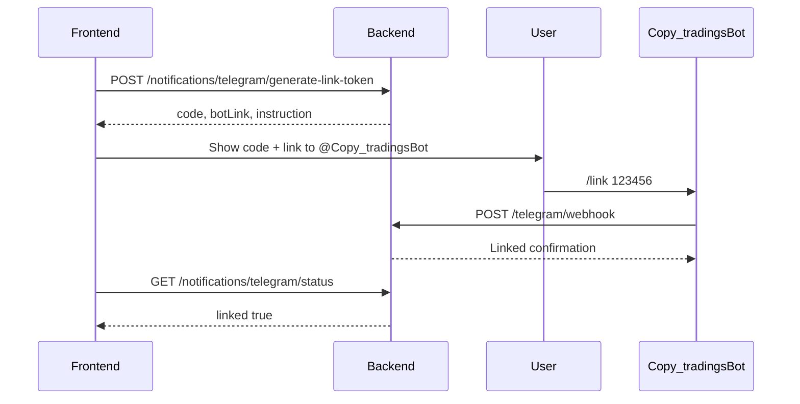

# Frontend Integration Guide — Backend Updates (May 2026)

Companion to [PLATFORM-GUIDE.md](./PLATFORM-GUIDE.md) and [ASCENTRA-SPEC-GAP.md](./ASCENTRA-SPEC-GAP.md).

| | |
|---|---|
| **Base URL (prod)** | `http://13.53.246.13:8081` or your API domain |
| **API prefix** | `/api/v1` |
| **Auth** | `Authorization: Bearer <accessToken>` |
| **Swagger** | `GET /swagger-ui.html` |

---

## Summary for FE team

| Question | Answer |
|----------|--------|
| **Must we release FE with backend?** | **No.** Existing flows keep working. |
| **When is FE required?** | Only if you ship **copy sides**, **risk pause**, **Telegram link**, **latency/history**, or **full profile** screens. |
| **Breaking API changes?** | **None** for existing request shapes. New fields are optional. |

### Backend behavior changes (no UI required, but good to know)

- **SELL copies** may be **skipped** more often (`INSUFFICIENT_POSITION`, `NO_POSITION`) — child must have live long qty.
- **F&O** qty below one lot → skip `SUB_LOT_SIZE`.
- **Intraday after 15:20 IST** → skip `MARKET_CLOSED` (notification + copy log).
- **Margin utilization** can block copies if child enabled `marginCheckEnabled` and over `maxCapitalExposure`.

---

## Table of contents

1. [Quick reference — new endpoints](#1-quick-reference--new-endpoints)
2. [Copy subscription settings](#2-copy-subscription-settings)
3. [Skip reasons & notifications](#3-skip-reasons--notifications)
4. [Profile & broker accounts](#4-profile--broker-accounts)
5. [Risk management UI](#5-risk-management-ui)
6. [Latency & trade history](#6-latency--trade-history)
7. [Telegram linking](#7-telegram-linking)
8. [Engine metadata](#8-engine-metadata)
9. [Screen → API mapping](#9-screen--api-mapping)
10. [TypeScript types (suggested)](#10-typescript-types-suggested)
11. [Related docs](#11-related-docs)

---

## 1. Quick reference — new endpoints

All require JWT unless noted **(public)**.

### Child

| Method | Path | Purpose |
|--------|------|---------|
| PATCH | `/child/subscriptions/copy-settings` | Update `copySides` / `allowShortSelling` |
| GET | `/child/trade-timeline` | Child copy timeline with latency |

`GET /child/subscriptions` now includes: `copySides`, `allowShortSelling`.

### Master

| Method | Path | Purpose |
|--------|------|---------|
| GET | `/master/trade-pnl` | Master P&L summary (basic until price jobs) |

### Engine

| Method | Path | Purpose |
|--------|------|---------|
| GET | `/engine/trade-history` | Paginated copy events (`?page=0&size=20`) |
| GET | `/engine/trade-history/{eventId}` | Event detail + per-child rows |
| GET | `/engine/latency-stats` | `?days=7` or `30` |
| GET | `/engine/config` | Detection methods, polling interval |
| GET | `/engine/metadata` | `copySidesOptions`, `skipReasons`, `notificationTypes` |

**Postback (broker console only, not FE):** `POST /engine/postback/zerodha` or `/brokers/postback/zerodha` **(public)**

### User profile (spec path)

| Method | Path | Purpose |
|--------|------|---------|
| GET | `/users/me/profile` | User + all broker account profiles |
| PUT | `/users/me/profile` | Update name / telegram chat id |

Legacy: `GET /auth/me`, `PUT /auth/me` still work.

### Broker

| Method | Path | Purpose |
|--------|------|---------|
| GET | `/brokers/accounts/{accountId}/profile` | Normalized profile (60s cache) |
| POST | `/brokers/accounts/{accountId}/refresh-profile` | Force refresh from broker |

### Risk

| Method | Path | Purpose |
|--------|------|---------|
| GET | `/risk/status` | Dashboard: trades today, margin %, blocked flag |
| GET | `/risk/exposure` | Capital exposure summary |
| GET | `/risk/check` | `?brokerAccountId=` optional |
| POST | `/risk/check-trade` | Pre-check a hypothetical trade |
| POST | `/risk/pause` | Emergency pause |
| POST | `/risk/resume` | Resume copying |
| GET | `/risk/rules` | Existing — get rules |
| PUT | `/risk/rules` | Existing — update rules |

### Telegram

| Method | Path | Purpose |
|--------|------|---------|
| POST | `/notifications/telegram/generate-link-token` | 6-digit link code |
| GET | `/notifications/telegram/status` | Linked? preferences |
| PUT | `/notifications/telegram/preferences` | Alert toggles |
| POST | `/notifications/telegram/test` | Send test message |
| POST | `/notifications/telegram/unlink` | Unlink |
| POST | `/telegram/webhook` | **(public)** — Telegram → backend |

---

## 2. Copy subscription settings

### On subscribe (optional fields)

**`POST /api/v1/child/subscriptions`**

```json
{
  "masterId": "uuid",
  "brokerAccountId": "uuid",
  "scalingFactor": 1.0,
  "copySides": "BUY_ONLY",
  "allowShortSelling": false
}
```

| Field | Values | Default | Meaning |
|-------|--------|---------|---------|
| `copySides` | `BUY_ONLY` \| `BUY_AND_SELL` \| `MIRROR` | `BUY_ONLY` | What sides to copy |
| `allowShortSelling` | boolean | `false` | With `MIRROR`, allow naked short if true |

**`copySides` behavior (for UI copy):**

| Value | BUY | SELL |
|-------|-----|------|
| `BUY_ONLY` | Copied | Only if copied BUY + live position ≥ sell qty |
| `BUY_AND_SELL` | Copied | Only if live position ≥ sell qty |
| `MIRROR` | Copied | Same as BUY_AND_SELL unless `allowShortSelling: true` |

### Update settings later

**`PATCH /api/v1/child/subscriptions/copy-settings`**

```json
{
  "masterId": "uuid",
  "copySides": "BUY_AND_SELL",
  "allowShortSelling": false
}
```

**Response:**

```json
{
  "masterId": "uuid",
  "copySides": "BUY_AND_SELL",
  "allowShortSelling": false,
  "message": "Copy settings updated"
}
```

### List subscriptions (new fields)

**`GET /api/v1/child/subscriptions`**

Each item now includes:

```json
{
  "masterId": "...",
  "masterName": "...",
  "scalingFactor": 1.0,
  "copySides": "BUY_ONLY",
  "allowShortSelling": false,
  "copyingStatus": "ACTIVE",
  "brokerAccountId": "...",
  "subscribedAt": "2026-05-20T..."
}
```

### UI: copy sides picker

Load options from **`GET /api/v1/engine/metadata`** → `copySidesOptions`:

```json
{
  "copySidesOptions": [
    {
      "id": "BUY_ONLY",
      "label": "Buy only (safe default)",
      "description": "Copy BUY; SELL only with copied BUY + live position"
    },
    {
      "id": "BUY_AND_SELL",
      "label": "Buy and sell",
      "description": "Copy BUY and SELL when child has live long qty"
    },
    {
      "id": "MIRROR",
      "label": "Mirror master",
      "description": "Copy all sides; optional naked short if allowShortSelling"
    }
  ]
}
```

Show **“Allow short selling”** toggle only when `copySides === "MIRROR"`.

---

## 3. Skip reasons & notifications

### Skip reasons (copy logs / timeline)

Use **`GET /engine/metadata`** → `skipReasons` or map locally:

| `skipReason` | Suggested UI label |
|--------------|-------------------|
| `ZERO_QUANTITY` | Scaled quantity is zero |
| `SUB_LOT_SIZE` | Below one F&O lot after scaling |
| `RISK_LIMIT` | Risk limit reached |
| `MAX_CAPITAL_EXPOSURE` | Margin utilization too high |
| `NO_POSITION` | No copied buy position for this symbol |
| `INSUFFICIENT_POSITION` | Not enough shares to sell |
| `SELL_BLOCKED` | Sell not allowed for this subscription |
| `MARKET_CLOSED` | Intraday copy blocked after market close |
| `COPY_PAUSED` | Copy trading paused |
| `SESSION_EXPIRED` | Broker session expired |

**`GET /child/copied-trades`** and **`GET /child/copy/logs`** may include `skipReason` on skipped rows.

### Notification types (handle in alerts UI)

| `type` | Action |
|--------|--------|
| `TRADE_COPIED` | Success toast |
| `TRADE_FAILED` | Error toast |
| `MARKET_CLOSED` | Warning — intraday not copied |
| `SESSION_EXPIRED` | Prompt re-login |
| `SESSION_EXPIRING` | Warning — session expiring soon |
| `SESSION_REMINDER` | Morning reminder |

**`GET /api/v1/notifications`** — unchanged shape; filter by `type` if needed.

---

## 4. Profile & broker accounts

### Full profile page (recommended for spec)

**`GET /api/v1/users/me/profile`**

```json
{
  "userId": "uuid",
  "name": "Rahul Sharma",
  "email": "rahul@example.com",
  "mobile": "+91...",
  "role": "CHILD",
  "createdAt": "...",
  "telegramLinked": true,
  "brokerAccounts": [
    {
      "accountId": "uuid",
      "broker": "ZERODHA",
      "clientId": "ZA1234",
      "fullName": "Rahul Sharma",
      "marginAvailable": 125000,
      "marginUsed": 48500,
      "marginUsedPercent": 27.9,
      "fundsUtilizationStatus": "GREEN",
      "sessionActive": true,
      "tokenExpiresAt": "...",
      "tokenExpiresInHours": 18,
      "isTokenExpired": false,
      "openPositionsCount": 3,
      "lastSyncedAt": "..."
    }
  ]
}
```

**`fundsUtilizationStatus`:** `GREEN` \| `YELLOW` \| `RED` — use for margin card color.

**`PUT /api/v1/users/me/profile`**

```json
{
  "displayName": "Rahul S.",
  "telegramChatId": "123456789"
}
```

Prefer **Telegram link flow** (§7) over manual `telegramChatId` when possible.

### Single broker profile

**`GET /api/v1/brokers/accounts/{accountId}/profile`**

Use on broker detail drawer/page. Cached 60s on server.

**`POST /api/v1/brokers/accounts/{accountId}/refresh-profile`**

Call when user taps **Refresh** on profile page.

---

## 5. Risk management UI

### Dashboard card

**`GET /api/v1/risk/status?brokerAccountId={uuid}`**

Pass child’s active `brokerAccountId` when known.

```json
{
  "maxTradesPerDay": 50,
  "tradesToday": 12,
  "tradesRemaining": 38,
  "maxOpenPositions": 20,
  "openPositions": 8,
  "positionsRemaining": 12,
  "maxCapitalExposure": 80,
  "marginCheckEnabled": true,
  "marginUtilizationPct": 45.2,
  "marginBlocked": false,
  "availableMargin": 75000,
  "usedMargin": 62000,
  "totalFunds": 137000,
  "copyPaused": false,
  "pausedUntil": null,
  "allowed": true
}
```

Show red banner when `allowed === false` or `marginBlocked === true`.

### Exposure summary

**`GET /api/v1/risk/exposure?brokerAccountId={uuid}`**

```json
{
  "totalCapital": 137000,
  "deployedCapital": 62000,
  "exposurePercent": 45.2,
  "openPositions": 8,
  "tradesPlacedToday": 12,
  "marginAvailable": 75000
}
```

### Pause / resume copying

**`POST /api/v1/risk/pause`**

```json
{
  "reason": "Manual pause",
  "pauseUntil": "2026-05-20T15:30:00Z"
}
```

**`POST /api/v1/risk/resume`** — no body.

### Pre-trade check (optional)

**`POST /api/v1/risk/check-trade?brokerAccountId={uuid}`**

```json
{
  "symbol": "NIFTY26MAY25900CE",
  "side": "BUY",
  "qty": 65,
  "price": 120.5,
  "product": "NRML"
}
```

```json
{
  "allowed": true,
  "warnings": [],
  "checks": [{ "rule": "composite", "status": "OK", "message": "OK" }],
  "symbol": "NIFTY26MAY25900CE"
}
```

### Risk rules (existing)

**`GET /PUT /api/v1/risk/rules`** — unchanged; fields:

- `maxTradesPerDay`
- `maxOpenPositions`
- `maxCapitalExposure` (percent, e.g. `80`)
- `marginCheckEnabled`

---

## 6. Latency & trade history

> **Note:** `eventId` = backend `copyGroupId` (UUID string per master copy batch).

### Master — trade history list

**`GET /api/v1/engine/trade-history?page=0&size=20&symbol=NIFTY&side=BUY`**

Query params (all optional): `page`, `size` (max 100), `from`, `to` (ISO dates), `symbol`, `side`.

```json
{
  "totalElements": 142,
  "page": 0,
  "size": 20,
  "content": [
    {
      "eventId": "uuid-copy-group",
      "symbol": "NIFTY26MAY25900CE",
      "side": "BUY",
      "masterQty": 65,
      "masterTriggeredAt": "2026-05-13T09:15:01.234Z",
      "avgChildLatencyMs": 278,
      "minChildLatencyMs": 245,
      "maxChildLatencyMs": 312,
      "childrenTotal": 5,
      "childrenSucceeded": 3,
      "childrenFailed": 2
    }
  ]
}
```

### Master — event detail

**`GET /api/v1/engine/trade-history/{eventId}`**

```json
{
  "eventId": "...",
  "symbol": "NIFTY26MAY25900CE",
  "side": "BUY",
  "children": [
    {
      "childName": "Rahul",
      "broker": "—",
      "status": "SUCCESS",
      "orderId": "...",
      "totalChildLatencyMs": 257,
      "brokerLatencyMs": 257
    }
  ]
}
```

### Master — latency stats

**`GET /api/v1/engine/latency-stats?days=7`**

```json
{
  "avgTotalLatencyMs": 312,
  "minTotalLatencyMs": 189,
  "maxTotalLatencyMs": 892,
  "p50LatencyMs": 290,
  "p95LatencyMs": 650,
  "p99LatencyMs": 820,
  "tradeCount": 87,
  "successRate": 94.2,
  "brokerBreakdown": []
}
```

### Child — timeline

**`GET /api/v1/child/trade-timeline`**

```json
{
  "trades": [
    {
      "eventId": "uuid",
      "masterName": "Alpha Trader",
      "symbol": "NIFTY25000CE",
      "side": "BUY",
      "masterTriggeredAt": "2026-05-13T09:15:01.234Z",
      "myOrderPlacedAt": "2026-05-13T09:15:01.567Z",
      "totalChildLatencyMs": 333,
      "status": "SUCCESS",
      "skipReason": null,
      "qty": 65
    }
  ]
}
```

### Master — trade P&L (basic)

**`GET /api/v1/master/trade-pnl`**

```json
{
  "summary": {
    "totalRealisedPnl": 0,
    "totalUnrealisedPnl": 0,
    "todayPnl": 0,
    "totalTrades": 42,
    "winRate": 0
  },
  "trades": []
}
```

Real P&L fields will improve when backend price-fetch jobs land.

---

## 7. Telegram linking

**Production bot:** [@Copy_tradingsBot](https://t.me/Copy_tradingsBot)

**Backend env (server only — never commit token):**

```bash
TELEGRAM_BOT_TOKEN=...        # from @BotFather
TELEGRAM_BOT_USERNAME=Copy_tradingsBot
TELEGRAM_ENABLED=true
```

Full ops guide: **[TELEGRAM-SETUP.md](./TELEGRAM-SETUP.md)** (webhook HTTPS, EC2, troubleshooting).

### How the user connects (UI copy)

1. Profile → **Connect Telegram** → **Generate code**  
2. Show: *Open **@Copy_tradingsBot** in Telegram and send:* `/link 123456`  
3. Optional button: open `https://t.me/Copy_tradingsBot`  
4. Poll **GET** `/notifications/telegram/status` until `linked: true`  
5. **Send test** to confirm  

### Flow



### 1. Generate code

**`POST /api/v1/notifications/telegram/generate-link-token`**

```json
{
  "code": "847291",
  "expiresAt": "2026-05-20T10:15:00Z",
  "botUsername": "Copy_tradingsBot",
  "botLink": "https://t.me/Copy_tradingsBot",
  "deepLink": "https://t.me/Copy_tradingsBot?start=link_847291",
  "instruction": "Open @Copy_tradingsBot in Telegram and send: /link 847291"
}
```

Display `instruction`, **Open Telegram** (`botLink`), and **Copy command** buttons.

### 2. Poll or refresh status

**`GET /api/v1/notifications/telegram/status`**

```json
{
  "linked": true,
  "chatId": "123456789",
  "preferences": {
    "tradeAlerts": true,
    "riskAlerts": true,
    "dailySummary": true,
    "systemAlerts": false,
    "alertOnSuccess": true,
    "alertOnFailure": true,
    "alertOnSkipped": true
  }
}
```

### 3. Update preferences

**`PUT /api/v1/notifications/telegram/preferences`**

```json
{
  "tradeAlerts": true,
  "riskAlerts": true,
  "alertOnSkipped": true
}
```

### 4. Test

**`POST /api/v1/notifications/telegram/test`**

```json
{ "sent": true }
```

### 5. Unlink

**`POST /api/v1/notifications/telegram/unlink`**

---

## 8. Engine metadata

**`GET /api/v1/engine/metadata`** — use once at app init or settings screen.

```json
{
  "copySidesOptions": [ ... ],
  "skipReasons": [
    "ZERO_QUANTITY",
    "SUB_LOT_SIZE",
    "RISK_LIMIT",
    "MAX_CAPITAL_EXPOSURE",
    "NO_POSITION",
    "INSUFFICIENT_POSITION",
    "SELL_BLOCKED",
    "MARKET_CLOSED",
    "SESSION_EXPIRED"
  ],
  "notificationTypes": [
    "TRADE_COPIED",
    "TRADE_FAILED",
    "MARKET_CLOSED",
    "SESSION_EXPIRED",
    "SESSION_EXPIRING",
    "SESSION_REMINDER"
  ]
}
```

---

## 9. Screen → API mapping

| Screen | Primary APIs | New? |
|--------|--------------|------|
| Login / register | `/auth/*` | No |
| Child — subscribe | `POST /child/subscriptions` (+ optional `copySides`) | **Optional fields** |
| Child — subscriptions list | `GET /child/subscriptions` | **+2 fields** |
| Child — copy settings | `PATCH /child/subscriptions/copy-settings` | **New** |
| Child — copied trades | `GET /child/copied-trades` | **+skipReason** |
| Child — timeline | `GET /child/trade-timeline` | **New** |
| Child — risk settings | `GET/PUT /risk/rules`, `GET /risk/status`, pause/resume | **Enhanced** |
| Child — positions | `GET /child/positions` | No |
| Master — dashboard | `GET /master/dashboard` | No |
| Master — latency | `GET /engine/trade-history`, `latency-stats` | **New** |
| Master — trade P&L | `GET /master/trade-pnl` | **New** |
| Profile | `GET /users/me/profile`, broker `.../profile` | **New paths** |
| Notifications bell | `GET /notifications` | **+types** |
| Telegram settings | `/notifications/telegram/*` | **New** |
| Broker link / login | `/brokers/*` | No |
| Engine admin toggle | `POST /engine/polling` | No |

---

## 10. TypeScript types (suggested)

```typescript
export type CopySides = 'BUY_ONLY' | 'BUY_AND_SELL' | 'MIRROR';

export interface SubscribeRequest {
  masterId: string;
  brokerAccountId: string;
  scalingFactor?: number;
  copySides?: CopySides;
  allowShortSelling?: boolean;
}

export interface CopySettingsRequest {
  masterId: string;
  copySides?: CopySides;
  allowShortSelling?: boolean;
}

export type SkipReason =
  | 'ZERO_QUANTITY'
  | 'SUB_LOT_SIZE'
  | 'RISK_LIMIT'
  | 'MAX_CAPITAL_EXPOSURE'
  | 'NO_POSITION'
  | 'INSUFFICIENT_POSITION'
  | 'SELL_BLOCKED'
  | 'MARKET_CLOSED'
  | 'COPY_PAUSED'
  | 'SESSION_EXPIRED';

export interface Subscription {
  masterId: string;
  masterName: string;
  scalingFactor: number;
  copySides: CopySides;
  allowShortSelling: boolean;
  copyingStatus: string;
  brokerAccountId: string;
  subscribedAt: string;
}

export interface RiskStatus {
  maxTradesPerDay: number;
  tradesToday: number;
  tradesRemaining: number;
  maxOpenPositions: number;
  openPositions: number;
  maxCapitalExposure: number;
  marginUtilizationPct: number;
  marginBlocked: boolean;
  allowed: boolean;
  copyPaused: boolean;
  pausedUntil: string | null;
}

export interface TelegramLinkTokenResponse {
  code: string;
  expiresAt: string;
  botUsername: string;
  instruction: string;
}
```

---

## 11. Related docs

| Document | Audience |
|----------|----------|
| [TELEGRAM-SETUP.md](./TELEGRAM-SETUP.md) | **How users join @Copy_tradingsBot + EC2 webhook** |
| [GAP-DOCS-CORRECTIONS.md](./GAP-DOCS-CORRECTIONS.md) | Fixes to external gap-analysis MD files |
| [PLATFORM-GUIDE.md](./PLATFORM-GUIDE.md) | Full backend API reference |
| [ASCENTRA-SPEC-GAP.md](./ASCENTRA-SPEC-GAP.md) | Spec v2 vs implementation matrix |
| [ENGINE-CHANGELOG.md](./ENGINE-CHANGELOG.md) | Engine audit changelog |
| Ascentra_Backend_Spec_v2.docx | Original product spec |

---

## Checklist for FE release (optional features)

- [ ] Copy sides dropdown on subscribe / settings
- [ ] Allow short selling toggle (MIRROR only)
- [ ] Skip reason labels in copy logs
- [ ] `MARKET_CLOSED` / `SESSION_EXPIRED` notification handling
- [ ] Risk status card + pause/resume buttons
- [ ] Profile page using `/users/me/profile`
- [ ] Telegram connect flow
- [ ] Master latency / trade history pages

**Minimum release:** none required — ship backend-only deploy if UI unchanged.
