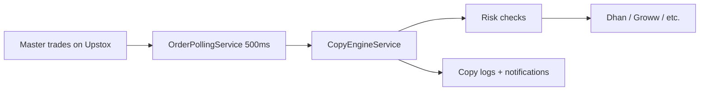

# Ascentra Copy-Trading Backend — Full Implementation Guide

| | |
|---|---|
| **Base URL (prod)** | `https://api.ascentracapital.com` or `http://13.53.246.13:8081` |
| **API prefix** | `/api/v1` |
| **Auth** | `Authorization: Bearer <accessToken>` (JWT, 15 min) |
| **Swagger** | `/swagger-ui.html` |
| **Health** | `GET /health` (public) |
| **Roles** | `MASTER` \| `CHILD` \| `ADMIN` |

---

## Table of contents

1. [What the platform does](#1-what-the-platform-does)
2. [Supported brokers](#2-supported-brokers)
3. [Authentication](#3-authentication)
4. [Broker accounts](#4-broker-accounts-link--session)
5. [Master APIs](#5-master-apis-apiv1master)
6. [Child APIs](#6-child-apis-apiv1child)
7. [Copy engine](#7-copy-engine-apiv1engine--core-product)
8. [Trade engine](#8-trade-engine-apiv1trades)
9. [Risk](#9-risk-apiv1risk)
10. [P&L](#10-pnl-apiv1pnl)
11. [Logs & notifications](#11-logs--notifications)
12. [Admin](#12-admin-apiv1admin--admin-role)
13. [WebSockets](#13-websockets-public-ws)
14. [Scheduled jobs](#14-scheduled-jobs-background)
15. [Infrastructure](#15-infrastructure)
16. [End-to-end setup](#16-end-to-end-setup)
17. [Log lines](#17-log-lines-to-know)
18. [Related docs](#18-related-docs-in-repo)

---

## 1. What the platform does

Copy-trading platform where:

1. A **master** links a broker (e.g. Upstox) and sets it as **active account**.
2. **Children** subscribe to the master, link their own broker (e.g. Dhan), and set **scaling** (e.g. `1.0` = same qty).
3. When the master **executes** a trade, the backend **copies** it to all **ACTIVE** children on their brokers.



---

## 2. Supported brokers

| Broker | Login method | Copy detection |
|--------|--------------|----------------|
| **Groww** | API key + secret (or token) | Polling 500ms |
| **Zerodha** | OAuth `request_token` | Postback webhook + polling |
| **Upstox** | OAuth `authCode` | Polling 500ms |
| **Dhan** | OAuth `tokenId` (consent flow) | Polling 500ms |
| **Fyers** | OAuth `authCode` | Polling 500ms |
| **Angel One** | Client code + password + TOTP | Polling 500ms |

Platform API keys live in `application.yml` (Groww, Zerodha, Upstox, Dhan, Fyers, Angel One).

---

## 3. Authentication

### Public (no JWT)

| Method | Path | Purpose |
|--------|------|---------|
| POST | `/api/v1/auth/register` | Register MASTER / CHILD / ADMIN |
| POST | `/api/v1/auth/login` | Email + password → JWT |
| POST | `/api/v1/auth/refresh-token` | New access token |
| POST | `/api/v1/auth/forgot-password` | Reset flow |
| POST | `/api/v1/auth/reset-password` | Set new password |
| POST | `/api/v1/auth/send-otp` | SMS OTP (AWS SNS) |
| POST | `/api/v1/auth/verify-otp` | Phone login |
| POST | `/api/v1/auth/validate-password` | Password check |
| GET | `/api/v1/brokers/callback` | OAuth redirect capture |
| POST | `/api/v1/brokers/postback/zerodha` | Zerodha order webhook |

### Authenticated

| Method | Path | Purpose |
|--------|------|---------|
| POST | `/api/v1/auth/logout` | Revoke refresh token |
| GET | `/api/v1/auth/me` | Profile |
| PUT | `/api/v1/auth/me` | Update profile |
| POST | `/api/v1/auth/2fa/enable` | Enable 2FA |
| POST | `/api/v1/auth/2fa/verify` | Verify 2FA |
| DELETE | `/api/v1/auth/2fa/disable` | Disable 2FA |

**Login response:** `accessToken`, `refreshToken`, `user` (role, email, etc.)

**OTP:** Stored in Redis (or in-memory fallback). SNS sends SMS when AWS keys are set; otherwise OTP is logged server-side.

---

## 4. Broker accounts (link + session)

All require JWT unless noted.

| Method | Path | How it works |
|--------|------|----------------|
| GET | `/api/v1/brokers` | List supported brokers + login types |
| POST | `/api/v1/brokers/accounts` | Link account (`brokerId`, `nickname`, keys if needed) |
| GET | `/api/v1/brokers/accounts` | List user's accounts + session summary |
| GET | `/api/v1/brokers/accounts/{id}` | One account |
| PUT | `/api/v1/brokers/accounts/{id}` | Update nickname / `clientId` |
| DELETE | `/api/v1/brokers/accounts/{id}` | Deactivate (soft if subscribed) |
| POST | `/api/v1/brokers/accounts/{id}/login` | **Start session** — body varies by broker |
| GET | `/api/v1/brokers/accounts/{id}/oauth-url` | OAuth URL for browser |
| GET | `/api/v1/brokers/accounts/{id}/status` | DB + **live margin ping** → `connectionHealth` |
| GET | `/api/v1/brokers/accounts/{id}/test` | Connection test (margin call) |
| GET | `/api/v1/brokers/accounts/{id}/margin` | Available / used margin |
| GET | `/api/v1/brokers/accounts/{id}/positions` | Live positions |
| GET | `/api/v1/brokers/accounts/{id}/orders` | Today's order book |
| GET | `/api/v1/brokers/accounts/{id}/trades` | Today's trades |
| GET | `/api/v1/brokers/accounts/{id}/holdings` | Holdings |
| GET | `/api/v1/brokers/accounts/{id}/dashboard` | Profile + margin + positions + orders |
| GET | `/api/v1/brokers/accounts/{id}/signal` | Connection bars 1–4 |
| GET | `/api/v1/brokers/accounts/{id}/balance-alert` | Low balance warning |
| PUT | `/api/v1/brokers/accounts/{id}/token` | Paste access token manually |
| POST | `/api/v1/brokers/accounts/{id}/orders/close-position` | Close position |
| DELETE | `/api/v1/brokers/accounts/{id}/orders/{orderId}` | Cancel order |

### Broker login bodies (`POST .../login`)

| Broker | Body |
|--------|------|
| **Zerodha** | `{ "requestToken": "..." }` from Kite redirect |
| **Upstox / Fyers** | `{ "authCode": "..." }` from OAuth redirect |
| **Dhan** | First call → returns `loginUrl`; second `{ "authCode": "<tokenId>" }` |
| **Groww** | `{}` or platform keys on account |
| **Angel One** | `{ "totpCode": "123456" }` (+ clientId/password on account) |

**OAuth callback** (`GET /brokers/callback`) only **returns** tokens — FE must call `POST .../login` with them.

**Session:** Token saved in DB; `sessionActive`, `expiresAt`. On 401 from broker APIs → `AUTH_REQUIRED`.

---

## 5. Master APIs (`/api/v1/master`)

Master manages children, active broker, and analytics.

| Method | Path | Purpose |
|--------|------|---------|
| GET | `/children` | List linked children + `copyingStatus` |
| POST | `/children/{childId}/link` | Link child + broker on subscription |
| POST | `/children/bulk-link` | Bulk link |
| POST | `/subscribe/{childId}` | Master-initiated subscribe |
| DELETE | `/children/{childId}/unlink` | Unlink |
| POST | `/children/bulk-unlink` | Bulk unlink |
| POST | `/children/{childId}/pause` | Pause copying |
| POST | `/children/{childId}/resume` | Resume copying |
| GET | `/children/pending` | Pending approval queue |
| POST | `/children/{childId}/approve` | Approve subscription |
| POST | `/children/{childId}/reject` | Reject |
| POST | `/children/{childId}/decline` | Decline |
| GET | `/children/{childId}/scaling` | Get scaling factor |
| PUT | `/children/{childId}/scaling` | Set scaling (e.g. 0.5, 1.0) |
| GET | `/analytics` | Master analytics |
| GET | `/dashboard` | Dashboard stats |
| GET | `/trade-history` | Master trade history |
| POST | `/active-account` | Set master source `{ "brokerAccountId": "uuid" }` |
| GET | `/active-account` | Get active broker account id |
| DELETE | `/active-account` | Clear active account |
| GET | `/copy/logs` | Copy logs (master view) |
| GET | `/earnings` | Earnings placeholder |
| GET | `/payouts` | Payouts placeholder |
| GET | `/positions` | **Live positions** from active broker + P&L |

**Required for auto-copy:** Active account set + session active + polling on.

---

## 6. Child APIs (`/api/v1/child`)

| Method | Path | Purpose |
|--------|------|---------|
| GET | `/masters` | Discover masters |
| POST | `/subscriptions` | Subscribe `{ masterId, brokerAccountId?, scalingFactor }` → often `PENDING_APPROVAL` |
| POST | `/subscriptions/bulk` | Bulk subscribe |
| DELETE | `/subscriptions/{masterId}` | Unsubscribe |
| POST | `/subscriptions/bulk-unsubscribe` | Bulk |
| GET | `/subscriptions` | My subscriptions |
| PUT | `/subscriptions/broker` | Switch broker for a master |
| GET | `/scaling` | Get scaling |
| PUT | `/scaling` | Update scaling |
| POST | `/copying/pause` | Pause `{ masterId }` |
| POST | `/copying/resume` | Resume |
| GET | `/copied-trades` | Trades copied to child |
| GET | `/analytics` | Child analytics |
| GET | `/copy/logs` | Copy logs |
| GET | `/positions` | Live positions on child broker |

---

## 7. Copy engine (`/api/v1/engine`) — core product

### How auto-copy works

1. **`OrderPollingService`** runs every **500 ms** (if `pollingEnabled`; configurable via `engine.polling.interval-ms`).
2. For each master with **active account**, fetches broker order book (Upstox: `GET /v2/order/retrieve-all`).
3. For orders with status **`complete` / `executed` / `traded`** (not while open/pending):
   - Dedup by `order_id` (memory + Redis + DB on reset).
   - Build `CopyTradeRequest` (symbol, qty, side, product, exchange, price, order type).
   - Call **`CopyEngineService.copyTrade()`**.
4. **`copyTrade()`** for each **ACTIVE** subscription:
   - Duplicate guard (same symbol+qty+minute, 60s).
   - **Risk:** max trades/day, max open positions.
   - **SELL guard:** skip SELL if child never got a copied BUY for that symbol since subscribe.
   - Scale qty: `floor(masterQty × scalingFactor)`.
   - **Market closed:** skip intraday equity copies outside 9:15–15:20 IST → notification (no broker order).
   - Place order on child broker (symbol mapping, F&O segment, product mapping).
   - Save trade, copy log, push notification, Telegram (if enabled), WebSocket event.

### Manual copy

| Method | Path | Body example |
|--------|------|----------------|
| POST | `/copy-trade` | `{ "symbol": "RELIANCE", "qty": 10, "side": "BUY", "product": "MIS", "orderType": "MARKET", "price": 0, "exchange": "NSE" }` |

Same engine path as polling; master JWT required.

### Polling control

| Method | Path | Purpose |
|--------|------|---------|
| GET | `/status` | Engine + `pollingEnabled` + supported brokers |
| POST | `/polling` | `{ "enabled": true/false }` — persisted in Redis |
| POST | `/polling/reset` | Clear known order IDs; reload from DB |
| GET | `/polling/status` | `lastResetAt`, auto-reset flag |

### Zerodha postback (faster than poll)

| Method | Path | Purpose |
|--------|------|---------|
| POST | `/api/v1/brokers/postback/zerodha` | Kite postback; on `COMPLETE` → copy immediately |

Configure in Kite developer console:

```
https://api.ascentracapital.com/api/v1/brokers/postback/zerodha
```

### Product mapping (child orders)

| Master (Upstox) | Normalized | Dhan child |
|-----------------|------------|------------|
| `D` | `CNC` (delivery) | `CNC` |
| `I` | `MIS` (intraday) | `INTRADAY` |

### Intraday market window

- **Allowed:** 9:15 AM – 3:20 PM IST (equity intraday).
- **Outside window:** copy is **skipped** (not placed on broker).
- **Notification** (master + child):  
  `Cannot place copy trade: market is closed for intraday orders (9:15 AM–3:20 PM IST).`
- **Delivery (`D` / CNC)** copies still work outside intraday hours.

### Recent production fixes

| Fix | Commit area |
|-----|-------------|
| Poll only after order is **filled** (not while OPEN) | `OrderPollingService` |
| Upstox orders URL: `retrieve-all` (was `retrieve/all`) | `UpstoxApiClient` |
| Upstox `D` → Dhan `CNC`, `I` → `INTRADAY` | `BrokerProductMapper` |
| Skip intraday copy after 15:20 IST + notify | `CopyEngineService` |

---

## 8. Trade engine (`/api/v1/trades`)

Alternative trade APIs (execute + replicate if caller is master):

| Method | Path | Purpose |
|--------|------|---------|
| POST | `/execute` | Place order + optional copy |
| GET | `/` | List trades |
| GET | `/{tradeId}` | One trade |
| DELETE | `/{tradeId}/cancel` | Cancel |
| GET | `/{tradeId}/replications` | Child replications |
| GET | `/open-positions` | Open positions |
| POST | `/basket` | Basket orders |

---

## 9. Risk (`/api/v1/risk`)

Per-child rules checked **before every copy**:

| Method | Path | Purpose |
|--------|------|---------|
| GET | `/rules` | Get limits |
| PUT | `/rules` | Set `maxTradesPerDay`, `maxOpenPositions`, etc. |
| GET | `/check` | Dry-run risk check |

Failures → copy status **SKIPPED** with reason in logs.

---

## 10. P&L (`/api/v1/pnl`)

| Method | Path | Purpose |
|--------|------|---------|
| GET | `/realized` | Realized P&L |
| GET | `/unrealized` | Unrealized P&L |
| GET | `/summary` | Summary |
| GET | `/child-vs-master` | Compare child vs master |
| GET | `/admin/pnl/all` | Admin: all users |

---

## 11. Logs & notifications

| Method | Path | Purpose |
|--------|------|---------|
| GET | `/api/v1/logs/trades` | Trade logs |
| GET | `/api/v1/logs/broker-errors` | Broker errors |
| GET | `/api/v1/copy/logs` | Copy-specific logs |
| GET | `/api/v1/notifications` | In-app notifications |
| PATCH | `/api/v1/notifications/{id}/read` | Mark read |
| POST | `/api/v1/notifications/read-all` | Mark all read |
| DELETE | `/api/v1/notifications/{id}` | Delete |

**Admin logs:** `/api/v1/admin/logs/trades`, `/system`, `/broker-errors`

---

## 12. Admin (`/api/v1/admin` — ADMIN role)

| Method | Path | Purpose |
|--------|------|---------|
| GET | `/users` | List users |
| POST | `/users/master` | Create master |
| POST | `/users/child` | Create child |
| GET | `/users/{userId}` | User detail |
| PUT | `/users/{userId}` | Update |
| PATCH | `/users/{userId}/activate` | Activate |
| PATCH | `/users/{userId}/deactivate` | Deactivate |
| DELETE | `/users/{userId}` | Delete |
| GET | `/analytics` | Platform analytics |
| GET | `/system-health` | Health overview |
| GET | `/subscriptions` | All subscriptions |
| GET | `/trade-logs` | Trade logs |
| GET | `/brokers/accounts` | All broker accounts |
| GET | `/brokers/status` | Broker API status |

---

## 13. WebSockets (public `/ws/**`)

| URL | Events |
|-----|--------|
| `ws://host/ws/trades` | `TRADE_DETECTED`, copy updates |
| `ws://host/ws/positions` | Position updates |
| `ws://host/ws/pnl` | P&L updates |
| `ws://host/ws/notifications` | Push notifications |

---

## 14. Scheduled jobs (background)

| Job | When | What |
|-----|------|------|
| **Order polling** | Every 500ms (default) | Scan master orders → copy |
| **Polling reset** | 9:15 AM IST weekdays | Clear known orders; reload from DB |
| **Session reminder** | 9:00 AM IST weekdays | Notify children with expired broker sessions |

---

## 15. Infrastructure

| Component | Use |
|-----------|-----|
| **PostgreSQL** (R2DBC) | Users, brokers, subscriptions, trades, copy logs |
| **Redis** (optional) | OTP, polling state, known order IDs |
| **AWS SNS** | OTP SMS |
| **Telegram** (optional) | Copy alerts to master |
| **Kafka** | Disabled by default (`APP_KAFKA_ENABLED=false`) |

---

## 16. End-to-end setup

### Master

1. `POST /api/v1/auth/login` → JWT
2. `POST /api/v1/brokers/accounts` → link Upstox
3. `GET /api/v1/brokers/accounts/{id}/oauth-url` → open URL → `POST .../login` with `authCode`
4. `POST /api/v1/master/active-account` → set Upstox account id
5. `GET /api/v1/engine/status` → `pollingEnabled: true`
6. Trade on Upstox → within ~0.5–1.5s child gets order on Dhan

### Child

1. Register / login
2. Link Dhan (`POST .../login` with tokenId flow)
3. `POST /api/v1/child/subscriptions` with `masterId` + `brokerAccountId`
4. Master `POST /api/v1/master/children/{id}/approve`
5. Copying status **ACTIVE** → receives copies

### Verify on EC2

```bash
grep -a -E "NEW_ORDER_DETECTED|COPY_ORDER_PLACED|COPY_SKIP|MARKET_CLOSED" /home/ec2-user/ascentra.log | tail -20
```

### Deploy

```bash
cd /home/ec2-user/copy-trading && git pull origin main
./gradlew clean build -x test --no-daemon
killall java 2>/dev/null; sleep 3
nohup java -Xmx512m -jar build/libs/copy-trading-backend-0.1.0.jar > /home/ec2-user/ascentra.log 2>&1 &
```

---

## 17. Log lines to know

| Log | Meaning |
|-----|---------|
| `NEW_ORDER_DETECTED` | Master fill seen |
| `COPY_ENGINE_START` | Copy started |
| `COPY_ORDER_PLACED` | Child broker order ok |
| `COPY_ORDER_FAILED` | Child order rejected |
| `COPY_SKIP` | Risk / no position / zero qty / **market closed** |
| `POLL_ORDERS_FAIL` | Could not fetch master orders |
| `MARKET_CLOSED` | Intraday copy skipped outside 9:15–15:20 IST |

---

## 18. Related docs in repo

| File | Content |
|------|---------|
| **`SYSTEM-ARCHITECTURE.md`** | **Full system build, architecture, tech stack, 500ms polling (May 2026)** |
| **`FE-CURRENT-INTEGRATION.md`** | **Primary FE integration guide** |
| **`FE-INTEGRATION-GUIDE.md`** | Extended FE guide — copySides, risk, Telegram |
| `FRONTEND-INTEGRATION-COMPLETE.md` | FE integration (legacy) |
| `BROKER-CONNECTION-FLOW.md` | Broker OAuth flows |
| `API-TESTING-GUIDE.md` | curl examples |
| `COPY-TRADE-LATENCY-API.md` | Timing fields |
| `scripts/curls.md` | Test curls |
| `COMPLETE-API-REFERENCE.md` | API reference |

---

*Last updated: May 2026 — commit `f41e47c` on `main`.*
