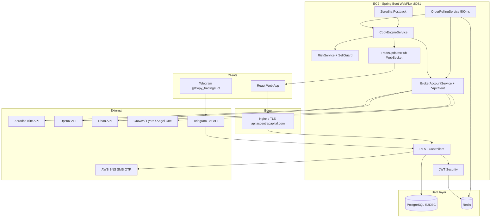
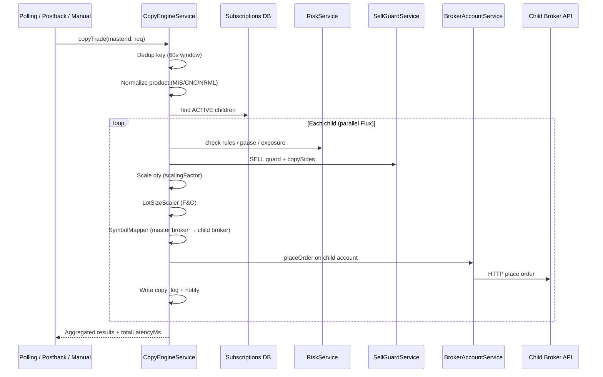
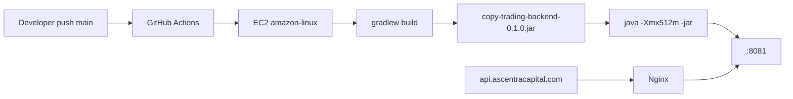

# Ascentra Copy-Trading Platform — System Architecture & Build Guide

**Audience:** Engineering, DevOps, product, and frontend teams who need to understand how the platform is built, how trades flow end-to-end, and how latency is controlled.

| | |
|---|---|
| **Product** | Multi-broker copy trading (master executes → children mirror on their brokers) |
| **Production API** | `https://api.ascentracapital.com` |
| **API prefix** | `/api/v1` |
| **Runtime** | Java 21, Spring Boot 3.2, Spring WebFlux (reactive) |
| **Deploy target** | AWS EC2 (`eu-north-1`), single JAR on port **8081** |
| **Last updated** | May 2026 |

---

## Table of contents

1. [What we built](#1-what-we-built)
2. [High-level architecture](#2-high-level-architecture)
3. [Technology stack](#3-technology-stack)
4. [Repository structure](#4-repository-structure)
5. [User roles & domain model](#5-user-roles--domain-model)
6. [Trade detection — how we see master orders](#6-trade-detection--how-we-see-master-orders)
7. [Copy engine pipeline](#7-copy-engine-pipeline)
8. [Latency model (500ms polling)](#8-latency-model-500ms-polling)
9. [Broker integration layer](#9-broker-integration-layer)
10. [Data & caching](#10-data--caching)
11. [Security & credentials](#11-security--credentials)
12. [Notifications (Telegram, in-app, WebSocket)](#12-notifications-telegram-in-app-websocket)
13. [Risk engine](#13-risk-engine)
14. [API surface (by module)](#14-api-surface-by-module)
15. [Infrastructure & deployment](#15-infrastructure--deployment)
16. [Configuration reference](#16-configuration-reference)
17. [Observability & operations](#17-observability--operations)
18. [How we built it — timeline of design decisions](#18-how-we-built-it--timeline-of-design-decisions)
19. [Related documentation](#19-related-documentation)

---

## 1. What we built

Ascentra is a **copy-trading backend** that:

1. Lets a **master** connect a live broker account (Upstox, Zerodha, Dhan, etc.) and designate it as the **active account**.
2. Lets **children** subscribe to that master, connect their own broker, and set **scaling** and **copy rules** (`copySides`, short selling, risk limits).
3. When the master **fills** an order, the backend **detects** it, **normalizes** it to a canonical order model, runs **risk and sell guards**, then **places** equivalent orders on each active child broker **in parallel** (reactive `Flux`).
4. Records **copy logs**, **latency**, pushes **notifications** (in-app + optional Telegram per user), and exposes **REST APIs** for web/mobile frontends.

The system is **backend-only** in this repo; the React frontend is a separate project that consumes `FE-CURRENT-INTEGRATION.md`.

---

## 2. High-level architecture



**Request path (typical child login):** Browser → HTTPS → Nginx → Spring Security (JWT) → Controller → Service → R2DBC PostgreSQL / Redis / WebClient to broker.

**Copy path (automatic):** Scheduler → `OrderPollingService` → broker order book API → `CanonicalOrderMapper` → `CopyEngineService.copyTrade` → per-child broker place order → `copy_logs` + notifications.

---

## 3. Technology stack

| Layer | Technology | Why we chose it |
|-------|------------|-----------------|
| **Language** | Java 21 | LTS, records/pattern matching, strong ecosystem for finance integrations |
| **Framework** | Spring Boot 3.2 | Mature DI, scheduling, security, reactive stack |
| **HTTP / IO** | **Spring WebFlux** + Project Reactor | Non-blocking I/O when calling multiple broker APIs and DB in parallel |
| **Database access** | **Spring Data R2DBC** + PostgreSQL driver | Reactive DB access aligned with WebFlux |
| **Database** | **PostgreSQL** (AWS RDS) | Relational model for users, subscriptions, trades, copy logs |
| **Cache** | **Redis** (reactive) | OTP, polling on/off flag, known order IDs (`poll:orders:*`), Telegram link codes |
| **Auth** | **JWT** (jjwt) + Spring Security WebFlux | Stateless API; 15 min access + 7 day refresh |
| **2FA** | TOTP (`dev.samstevens.totp`) | Authenticator apps |
| **SMS OTP** | **AWS SNS** | India DLT-capable transactional SMS |
| **Broker HTTP** | **WebClient** per broker (`*ApiClient` classes) | Shared reactive HTTP client pattern |
| **API docs** | springdoc OpenAPI 2.5 | `/swagger-ui.html` |
| **Scheduling** | `@EnableScheduling` + `@Scheduled` | Polling loop, market-open cache reset, session reminders |
| **Messaging (optional)** | Kafka | **Disabled by default** (`APP_KAFKA_ENABLED=false`); trade replication scaffold exists |
| **Deploy** | Gradle fat JAR, GitHub Actions SSH to EC2 | Simple ops on single instance |
| **Alerts** | Telegram Bot API | Per-user linking via `/link CODE` |

### Key dependencies (`build.gradle`)

- `spring-boot-starter-webflux`
- `spring-boot-starter-security`
- `spring-boot-starter-data-r2dbc` + `r2dbc-postgresql`
- `spring-boot-starter-data-redis-reactive`
- `spring-kafka` (optional)
- `jjwt` 0.11.5
- `springdoc-openapi-starter-webflux-ui`
- `software.amazon.awssdk:sns`

---

## 4. Repository structure

```
src/main/java/com/copytrading/
├── CopyTradingApplication.java      # @SpringBootApplication + @EnableScheduling
├── auth/                              # Login, OTP, JWT, 2FA, register
├── security/                          # SecurityConfig, JWT filter, credential encryption
├── user/                              # GET/PUT /users/me/profile
├── broker/                            # Accounts, OAuth, *ApiClient, BrokerAccountService
│   ├── zerodha/ upstox/ dhan/ groww/ fyers/ angelone/
├── master/                            # Active account, children, analytics
├── child/                             # Subscriptions, copy-settings, trade-timeline
├── subscription/                      # Subscription entity, CopySides enum
├── engine/                            # ★ Core copy product
│   ├── OrderPollingService.java       # 500ms scheduler
│   ├── CopyEngineService.java         # Replicate to children
│   ├── CanonicalOrderMapper.java      # Broker JSON → CanonicalOrder
│   ├── OrderNormalizer.java           # Status/side/qty extraction
│   ├── SymbolMapper.java              # Cross-broker symbol mapping
│   ├── SellGuardService.java          # SELL / position checks
│   ├── LotSizeScaler.java             # F&O lot rounding
│   ├── BrokerProductMapper.java       # MIS/CNC/NRML normalization
│   └── BrokerPostbackController.java  # Zerodha instant webhook
├── risk/                              # Rules, pause, exposure, check-trade
├── logs/                              # Copy logs, trade logs, broker errors
├── notification/                      # In-app + Telegram link/webhook
├── pnl/                               # P&L endpoints
├── admin/                             # Admin dashboards
├── ws/                                # WebSocket trade/position/pnl hubs
├── cache/                             # Redis: PollingStateCache, BrokerTokenCache
└── config/                            # SchemaInitializer, EnginePollingProperties

src/main/resources/
└── application.yml                    # DB, Redis, JWT, brokers, engine.polling, telegram

.github/workflows/deploy.yml           # Push main → EC2 build + restart
scripts/start-backend.sh               # Single-instance EC2 start
```

---

## 5. User roles & domain model

| Role | Responsibility |
|------|----------------|
| **MASTER** | Links broker, sets **active account**, trades; engine monitors that account |
| **CHILD** | Subscribes to master(s), links own broker, receives copied orders |
| **ADMIN** | Platform oversight, logs, user management |

**Core tables (conceptual):**

| Entity | Purpose |
|--------|---------|
| `users` | Account, role, `telegram_chat_id`, 2FA flags |
| `broker_accounts` | Per-user broker link, encrypted tokens, session expiry |
| `master_active_account` | Which broker account the poller watches per master |
| `subscriptions` | Child ↔ master, scaling, `copySides`, `copyingStatus` |
| `trades` | Master/child trade records |
| `copy_logs` | Per-child copy attempt with status, skip reason, latency fields |
| `risk_rules` / `risk_limits` | Child risk configuration |

---

## 6. Trade detection — how we see master orders

We support **three detection modes** (not all brokers use all modes):

| Mode | Latency (typical) | Brokers | Implementation |
|------|-------------------|---------|----------------|
| **Postback / webhook** | ~50–150 ms | Zerodha | `POST /api/v1/brokers/postback/zerodha` → immediate `copyTrade` |
| **Polling** | ~500 ms + broker API RTT | Upstox, Dhan, Groww, Fyers, Angel One | `OrderPollingService` every **500 ms** (`fixedDelay`) |
| **Manual** | Immediate | All | `POST /api/v1/engine/copy-trade` (master triggers) |

### Polling algorithm (`OrderPollingService`)

1. Every **500 ms** (configurable), if `pollingEnabled` and not resetting:
2. Load all rows from `master_active_account`.
3. For each master, if broker session active → `GET` today's order book from broker API.
4. Parse each order → `CanonicalOrderMapper.fromBrokerOrder`.
5. **Only copy when `canonical.isReadyForCopy()`** — typically **COMPLETE** with filled qty (partial fills stay in book until done).
6. **Dedup** (3 layers):
   - In-memory `knownOrders` set per master
   - `processingOrders` lock (same order not processed twice in one cycle)
   - Redis `poll:orders:{masterId}` (survives restart)
7. On new order → save master `Trade`, WebSocket `TRADE_DETECTED`, call `CopyEngineService.copyTrade`.

**Market open reset:** Cron **9:15 AM IST** clears known-order cache and reloads today's `broker_order_id` from DB so yesterday's orders are not re-fired.

### Zerodha postback (lowest latency path)

Configure in Kite developer console:

`https://api.ascentracapital.com/api/v1/brokers/postback/zerodha`

Alias also available: `/api/v1/engine/postback/zerodha`

Postback bypasses the 500 ms poll delay for Zerodha masters.

---

## 7. Copy engine pipeline

Entry: `CopyEngineService.copyTrade(masterId, CopyTradeRequest)`



**Important services in the pipeline:**

| Component | File | Role |
|-----------|------|------|
| Canonical model | `CanonicalOrder.java`, `CanonicalOrderMapper.java` | One shape for all brokers |
| Normalization | `OrderNormalizer.java` | Status, side, filled qty, segment |
| Symbol mapping | `SymbolMapper.java` | Map symbols across brokers (equity + F&O) |
| Product mapping | `BrokerProductMapper.java` | Align intraday/delivery product types |
| Sell guard | `SellGuardService.java` | `BUY_ONLY`, position checks, short selling flag |
| Lot scaler | `LotSizeScaler.java` | Round F&O qty to exchange lot size |
| Risk | `RiskService.java` | Daily trade count, open positions, margin block, pause |

**Skip reasons** (stored on copy log, labels in `GET /engine/metadata`):  
`ZERO_QUANTITY`, `SUB_LOT_SIZE`, `RISK_LIMIT`, `MAX_CAPITAL_EXPOSURE`, `NO_POSITION`, `INSUFFICIENT_POSITION`, `SELL_BLOCKED`, `MARKET_CLOSED`, `SESSION_EXPIRED`, `COPY_PAUSED`.

---

## 8. Latency model (500ms polling)

### Configuration

```yaml
# application.yml
engine:
  polling:
    interval-ms: 500          # ENV: ENGINE_POLLING_INTERVAL_MS
    initial-delay-ms: 15000   # ENV: ENGINE_POLLING_INITIAL_DELAY_MS
```

Spring uses **`fixedDelay`**: the next poll starts **after** the previous cycle **finishes**. So:

- **Best-case detection delay** ≈ `interval-ms` (500 ms) if the order appears right after a poll.
- **Worst-case** ≈ `interval-ms` + duration of one full poll cycle (all masters × broker API latency).

### End-to-end budget (polling brokers, e.g. Upstox master → Dhan child)

| Stage | Typical time |
|-------|----------------|
| Wait for next poll | 0–500 ms |
| Fetch master order book | 100–400 ms |
| Engine + risk + mapping | 20–80 ms |
| Place child order (Dhan API) | 150–500 ms |
| **Total (user-perceived)** | **~0.5–1.5 s** |

Zerodha postback path removes the poll wait → often **&lt; 500 ms** total.

### Tuning notes

- **500 ms** balances API rate limits vs speed. Going lower (e.g. 200 ms) increases broker API load and risk of throttling.
- Poll runs **one reactive chain per master**; many masters increase cycle time — consider horizontal scaling or broker websockets later.
- `GET /api/v1/engine/config` returns live `pollingIntervalMs` for dashboards.

---

## 9. Broker integration layer

Each broker has a dedicated `*ApiClient` (WebClient) used by `BrokerAccountService`:

| Broker | Client class | Login | Order book / place order |
|--------|--------------|-------|---------------------------|
| Zerodha | `ZerodhaApiClient` | OAuth `requestToken` | Kite Connect REST |
| Upstox | `UpstoxApiClient` | OAuth `authCode` | Upstox v2 API |
| Dhan | `DhanApiClient` | Consent + `tokenId` | Dhan REST |
| Groww | `GrowwApiClient` | API key / token | Groww integration API |
| Fyers | `FyersApiClient` | OAuth `authCode` | Fyers API v3 |
| Angel One | `AngelOneApiClient` | TOTP login | SmartAPI |

**OAuth flow:** FE opens `GET /brokers/accounts/{id}/oauth-url` → user completes broker login → redirect to `GET /brokers/callback` → FE posts token to `POST /brokers/accounts/{id}/login` using dynamic **`loginField`** from oauth-url response.

**Session management:** Access tokens stored encrypted in PostgreSQL; `BrokerSessionExpiryMonitor` checks expiry; 401 from broker marks session inactive and notifies user.

---

## 10. Data & caching

| Store | Technology | What we store |
|-------|------------|---------------|
| **PostgreSQL** | AWS RDS, SSL | Users, brokers, subscriptions, trades, copy_logs, risk |
| **Redis** | Optional URL `REDIS_URL` | OTP, `poll:enabled`, `poll:orders:{masterId}`, Telegram link codes |
| **In-memory** | JVM | `knownOrders`, dedup keys, `InstrumentCache`, recent order keys (60s) |

**Schema:** `SchemaInitializer` runs idempotent `ALTER TABLE ... IF NOT EXISTS` on startup for migrations without Flyway.

**Credential encryption:** `CredentialCrypto` + `CredentialMigrationRunner` encrypt broker secrets at rest.

---

## 11. Security & credentials

| Concern | Implementation |
|---------|----------------|
| API auth | JWT Bearer, roles `MASTER` / `CHILD` / `ADMIN` |
| Public routes | Login, register, OTP, health, broker OAuth callback, Zerodha postback, `GET /notifications/telegram/bot`, Telegram webhook |
| Copy logs | Scoped by JWT role (master vs child sees own logs) |
| Broker tokens | Encrypted in DB; never returned in API responses |
| Telegram | Bot token only on server env (`TELEGRAM_BOT_TOKEN`) |

---

## 12. Notifications (Telegram, in-app, WebSocket)

| Channel | How |
|---------|-----|
| **In-app** | `NotificationService.push` → DB + optional WebSocket `/ws/notifications` |
| **Telegram** | Per-user: generate 6-digit code → user sends `/link CODE` to @Copy_tradingsBot → webhook saves `telegram_chat_id` |
| **Trade WebSocket** | `TradeUpdatesHub` publishes `TRADE_DETECTED` on `/ws/trades` |

See `TELEGRAM-SETUP.md` for EC2 webhook registration.

---

## 13. Risk engine

Child-level controls via `/api/v1/risk/*`:

- Max trades per day, max open positions
- Margin utilization / `marginBlocked`
- Copy pause / resume (`copyPaused`, `pausedUntil`)
- Pre-trade check: `POST /risk/check-trade`

Risk runs **before** child order placement inside `CopyEngineService.replicateToChild`.

---

## 14. API surface (by module)

| Prefix | Module |
|--------|--------|
| `/api/v1/auth` | Login, OTP, 2FA, profile |
| `/api/v1/users/me/profile` | Broker margin profile (spec) |
| `/api/v1/brokers` | Connect, OAuth, orders, positions, dashboard |
| `/api/v1/master` | Active account, children, trade P&L |
| `/api/v1/child` | Subscribe, copy-settings, trade-timeline, copy logs |
| `/api/v1/engine` | Copy trade, polling, history, latency, metadata |
| `/api/v1/risk` | Rules, status, exposure, pause |
| `/api/v1/notifications/telegram` | Bot config, link, preferences |
| `/api/v1/admin` | Admin-only analytics and logs |
| `/ws/*` | Real-time updates (public path, auth varies) |

**Frontend contract:** `FE-CURRENT-INTEGRATION.md`  
**Operational behaviour:** `PLATFORM-GUIDE.md`

---

## 15. Infrastructure & deployment



| Item | Detail |
|------|--------|
| **CI/CD** | `.github/workflows/deploy.yml` on push to `main` |
| **Host** | EC2 `13.53.246.13` (also HTTPS via domain) |
| **Start script** | `scripts/start-backend.sh` — kills port 8081, sources `.bashrc` for Telegram env |
| **Logs** | `/home/ec2-user/ascentra.log` |
| **DB** | RDS PostgreSQL `eu-north-1` |
| **Redis** | Local or ElastiCache via `REDIS_URL` |

**Important ops note:** Only **one** Java process should bind 8081. Duplicate `ascentra.service` + manual `nohup` caused port conflicts in production — use a single startup method.

---

## 16. Configuration reference

| Variable / key | Purpose |
|----------------|---------|
| `PORT` | HTTP port (default 8081) |
| `SPRING_R2DBC_URL` | PostgreSQL R2DBC URL |
| `REDIS_URL` | Redis connection |
| `JWT_SECRET` | JWT signing |
| `ENGINE_POLLING_INTERVAL_MS` | Override poll interval (default **500**) |
| `ENGINE_POLLING_INITIAL_DELAY_MS` | Startup delay before first poll (default 15000) |
| `TELEGRAM_BOT_TOKEN` | Telegram bot |
| `TELEGRAM_ENABLED` | `true` to send alerts |
| `TELEGRAM_WEBHOOK_BASE_URL` | Public HTTPS base for webhook |
| `APP_KAFKA_ENABLED` | `false` = Kafka autoconfig excluded |
| `AWS_*` | SNS for OTP SMS |
| Broker `*_API_KEY` | Per-broker platform keys in `application.yml` or env |

---

## 17. Observability & operations

### Log patterns to grep on EC2

```bash
grep -a -E "NEW_ORDER_DETECTED|COPY_ENGINE_START|COPY_ORDER_PLACED|COPY_SKIP|POLL_ERROR" \
  /home/ec2-user/ascentra.log | tail -30
```

| Log line | Meaning |
|----------|---------|
| `NEW_ORDER_DETECTED` | Master fill seen by poller/postback |
| `COPY_ENGINE_START` | Copy started for symbol/qty |
| `COPY_ORDER_PLACED` | Child broker accepted order |
| `COPY_SKIP` | Risk, sell guard, market closed, etc. |
| `POLL_ERROR` | Could not poll master (session/API) |
| `POLLING_STATE_RESTORED` | Redis restored polling on/off |

### Health

- `GET /health` — public
- `GET /api/v1/engine/status` — polling enabled + interval

---

## 18. How we built it — timeline of design decisions

| Phase | Decision |
|-------|----------|
| **Foundation** | Spring WebFlux + R2DBC for non-blocking broker I/O; monolithic JAR for fast EC2 deploy |
| **Multi-broker** | Per-broker `*ApiClient` instead of one adapter — each API differs too much |
| **Detection v1** | Polling only (simple, works for all brokers) |
| **Detection v2** | Zerodha postback for sub-second path; kept polling as fallback |
| **Normalization** | `CanonicalOrder` + `OrderNormalizer` after production bugs (wrong side/qty/partial fills) |
| **Safety** | `SellGuardService`, `copySides`, risk pause, market hours for intraday |
| **F&O** | `LotSizeScaler`, `SymbolMapper` with segment awareness |
| **State** | Redis for known order IDs so restart does not re-copy |
| **Latency** | Reduced poll interval **1s → 500ms** (configurable) |
| **Spec alignment** | Trade timeline, latency stats, profile margins, Telegram per-user linking |
| **Security** | Encrypt broker credentials; JWT-scoped copy logs |

**Future improvements (not yet built):**

- Broker-native WebSockets (Fyers/Upstox) for &lt;100 ms detection
- Persist `allocationAmount` on subscribe
- Kafka-enabled event bus for multi-instance engine
- Auto-restart via `systemd` + `EnvironmentFile` for Telegram on reboot

---

## 19. Related documentation

| Document | Use |
|----------|-----|
| **`FE-CURRENT-INTEGRATION.md`** | Frontend API integration (primary) |
| **`PLATFORM-GUIDE.md`** | API catalogue + ops flows |
| **`TELEGRAM-SETUP.md`** | Telegram webhook on EC2 |
| **`GAP-DOCS-CORRECTIONS.md`** | Fixes to old external gap analyses |
| **`FE-INTEGRATION-GUIDE.md`** | Extended FE notes |
| **`COPY-TRADE-LATENCY-API.md`** | Latency field definitions |

---

*Primary architecture reference for Ascentra copy-trading backend. Polling default: **500 ms** (`engine.polling.interval-ms`).*
